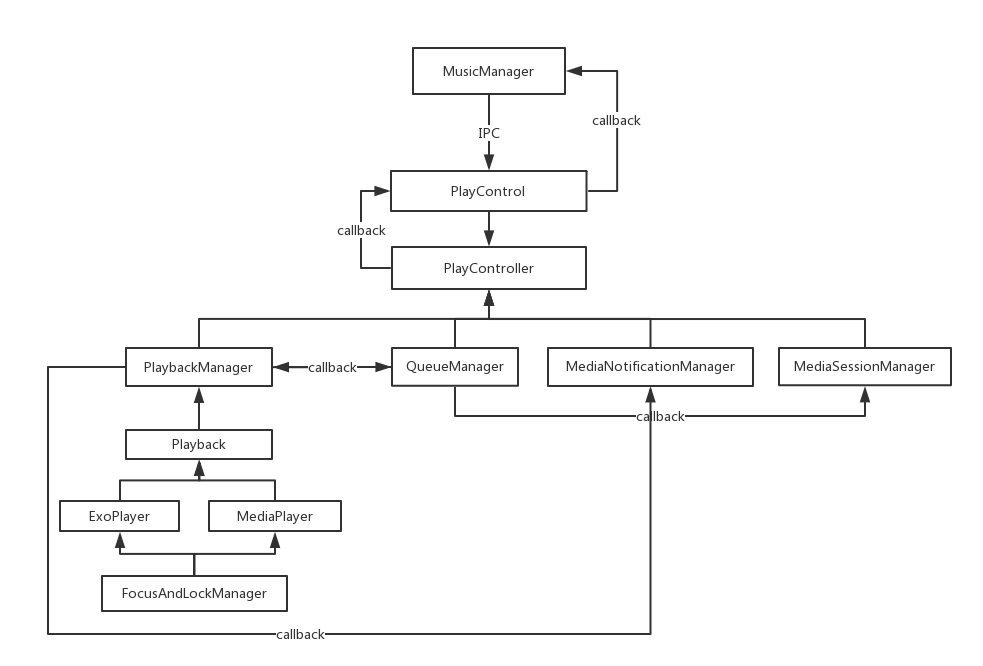

### 代码实现原理和解释

#### 结构图
不知道画得准不准确，大概就这样的结构吧 -_-!


#### 一些主要的类说明
关于 IPC 和 AIDL 等用法和原理不再讲，如果不了解请自己查阅资料。  
可以看到，`PlayControl`其实是一个`Binder`,连接着客户端和服务端。  

##### QueueManager
`QueueManager` 是播放列表管理类，里面维护着当前的播放列表和当前的音频索引。  
播放列表存储在一个 ArrayList 里面,音频索引默认是 0：
```java
public QueueManager(MetadataUpdateListener listener, PlayMode playMode) {
    mPlayingQueue = Collections.synchronizedList(new ArrayList<SongInfo>());
    mCurrentIndex = 0;
    ...
}
```

当调用设置播放列表相关API的时候，实际上是调用了里面的`setCurrentQueue`方法，每次播放列表都会先清空，再赋值：
```java
public void setCurrentQueue(List<SongInfo> newQueue, int currentIndex) {
    int index = 0;
    if (currentIndex != -1) {
        index = currentIndex;
    }
    mCurrentIndex = Math.max(index, 0);
    mPlayingQueue.clear();
    mPlayingQueue.addAll(newQueue);
    //通知播放列表更新了
    List<MediaSessionCompat.QueueItem> queueItems = QueueHelper.getQueueItems(mPlayingQueue);
    if (mListener != null) {
        mListener.onQueueUpdated(queueItems, mPlayingQueue);
    }
}
```
当播放列表更新后，会把播放列表封装成一个 QueueItem 列表回调给 MediaSessionManager 做锁屏的时候媒体相关的操作。

得到当前播放音乐，播放指定音乐等操作实际上是操作音频索引`mCurrentIndex`,然后根据索引取出列表中对应的音频信息。

上一首下一首等操作，实际上是调用了`skipQueuePosition`方法，这个方法中采用了取余的算法来计算上一首下一首的索引，  
而不是加一或者减一，这样的一个好处是避免了数组越界或者说计算更方便：
```java
public boolean skipQueuePosition(int amount) {
    int index = mCurrentIndex + amount;
    if (index < 0) {
        // 在第一首歌曲之前向后跳，让你在第一首歌曲上
        index = 0;
    } else {
        //当在最后一首歌时点下一首将返回第一首个
        index %= mPlayingQueue.size();
    }
    if (!QueueHelper.isIndexPlayable(index, mPlayingQueue)) {
        return false;
    }
    mCurrentIndex = index;
    return true;
}
```
参数 amount 是维度的意思，可以看到，传 1 则会取下一首，传 -1 则会取上一首，事实上可以取到任何一首音频，  
只要维度不一样就可以。

播放音乐时，先是调用了`setCurrentQueueIndex`方法设置好音频索引后再通过回调交给`PlaybackManager`去做真正的播放处理。
```java
private void setCurrentQueueIndex(int index, boolean isJustPlay, boolean isSwitchMusic) {
    if (index >= 0 && index < mPlayingQueue.size()) {
        mCurrentIndex = index;
        if (mListener != null) {
            mListener.onCurrentQueueIndexUpdated(mCurrentIndex, isJustPlay, isSwitchMusic);
        }
    }
}
```
QueueManager 需要说明的感觉就这些，其他如果有兴趣可以clone代码后再具体细看。

##### PlaybackManager
PlaybackManager 是播放管理类，负责操作播放，暂停等播放控制操作。  
它实现了 Playback.Callback 接口，而 Playback 是定义了播放器相关操作的接口。  
具体的播放器 ExoPlayer、MediaPlayer 的实现均实现了 Playback 接口，而 PlaybackManager 则是通过 Playback  
来统一管理播放器的相关操作。
所以，如果想再添加一个播放器，只需要实现 Playback 接口即可。  

播放：
```java
public void handlePlayRequest() {
    SongInfo currentMusic = mQueueManager.getCurrentMusic();
    if (currentMusic != null) {
        String mediaId = currentMusic.getSongId();
        boolean mediaHasChanged = !TextUtils.equals(mediaId, mCurrentMediaId);
        if (mediaHasChanged) {
            mCurrentMediaId = mediaId;
            notifyPlaybackSwitch(currentMusic);
        }
        //播放
        mPlayback.play(currentMusic);
        //更新媒体信息
        mQueueManager.updateMetadata();
        updatePlaybackState(null);
    }
}
```
播放方法有几个步骤：
1. 取出要播放的音频信息。
2. 根据音频 id 的对比来判断是否回调切歌方法。如果 id 不一样，则代表需要切歌。
3. 然后再调用`mPlayback.play(currentMusic)`交给具体播放器去播放。
4. 然后更新媒体操作的音频信息（就是锁屏时的播放器）。
5. 回调播放状态状态。

暂停：
```java
public void handlePauseRequest() {
    if (mPlayback.isPlaying()) {
        mPlayback.pause();
        updatePlaybackState(null);
    }
}
```
暂停是直接交给具体播放器去暂停，然后回调播放状态状态。

停止：
```java
public void handleStopRequest(String withError) {
    mPlayback.stop(true);
    updatePlaybackState(withError);
}
```
停止也是同样道理。

基本上`PlaybackManager`里面的操作都是围绕着这三个方法进行，其他则是一些封装和回调的处理。  
具体的播放器实现参考的是Google的官方例子 [android-UniversalMusicPlayer](https://github.com/googlesamples/android-UniversalMusicPlayer) 这项目真的非常不错。

##### MediaSessionManager
这个类主要是管理媒体信息`MediaSessionCompat`,他的写法是比较固定的，可以参考这篇文章中的[联动系统媒体中心](https://www.jianshu.com/p/bc2f779a5400) 的介绍  
也可以参考 Google的官方例子

##### MediaNotificationManager
这个类是封装了通知栏的相关操作。自定义通知栏的情况可算是非常复杂了，远不止是 new 一个 Notification。（可能我还是菜鸟）

###### 通知栏的分类
NotificationCompat.Builder 里面 `setContentView` 的方法一共有两个，一个是 `setCustomContentView()`  
一个是 `setCustomBigContentView()` 可知道区别就是大小的区别吧，对应的 RemoteView 也是两个：RemoteView 和 BigRemoteView

而不同的手机，有的通知栏背景是白色的，有的是透明或者黑色的，这时候你就需要根据不同的背景显示不同的样式（除非你在布局里面写死背景色，但是那样真的很丑）  
所以通知栏总共需要的布局有四个：
1. 白色背景下 ContentView
2. 白色背景下 BigContentView
3. 黑色背景下 ContentView
4. 黑色背景下 BigContentView

设置 ContentView 如下所示：
```java
...
if (Build.VERSION.SDK_INT >= 24) {
    notificationBuilder.setCustomContentView(mRemoteView);
    if (mBigRemoteView != null) {
        notificationBuilder.setCustomBigContentView(mBigRemoteView);
    }
}
...
Notification notification;
if (Build.VERSION.SDK_INT >= 16) {
    notification = notificationBuilder.build();
} else {
    notification = notificationBuilder.getNotification();
}
if (Build.VERSION.SDK_INT < 24) {
    notification.contentView = mRemoteView;
    if (Build.VERSION.SDK_INT >= 16 && mBigRemoteView != null) {
        notification.bigContentView = mBigRemoteView;
    }
}
...
```

在配置通知栏的时候，最重要的就是如何获取到对应的资源文件和布局里面相关的控件，是通过 `Resources#getIdentifier` 方法去获取：
```java
private Resources res;
private String packageName;

public MediaNotificationManager(){
     packageName = mService.getApplicationContext().getPackageName();
     res = mService.getApplicationContext().getResources();
}

private int getResourceId(String name, String className) {
    return res.getIdentifier(name, className, packageName);
}
```
因为需要能动态配置，所以对通知栏的相关资源和id等命名就需要制定好约定了。比如我要获取  
白色背景下ContentView的布局文件赋值给RemoteView：
```java
RemoteViews remoteView = new RemoteViews(packageName, 
                                         getResourceId("view_notify_light_play", "layout"));
```
只要你的布局文件命名为 `view_notify_light_play.xml` 就能正确获取了。  
所以不同的布局和不同的资源获取全部都是通过 `getResourceId` 方法获取。


###### 更新通知栏UI

更新UI分为下面3个步骤：
1. 重新新建 RemoteView 替换旧的 RemoteView
2. 将新的 RemoteView 赋值给 Notification.contentView 和 Notification.bigContentView
3. 更新 RemoteView 的 UI
4. 调用 NotificationManager.notify(NOTIFICATION_ID, mNotification); 去刷新。

更新开始播放的时候播放/暂停按钮UI：
```java
public void updateViewStateAtStart() {
    if (mNotification != null) {
        boolean isDark = NotificationColorUtils.isDarkNotificationBar(mService);
        mRemoteView = createRemoteViews(isDark, false);
        mBigRemoteView = createRemoteViews(isDark, true);
        if (Build.VERSION.SDK_INT >= 16) {
            mNotification.bigContentView = mBigRemoteView;
        }
        mNotification.contentView = mRemoteView;
        if (mRemoteView != null) {
            mRemoteView.setImageViewResource(getResourceId(ID_IMG_NOTIFY_PLAY_OR_PAUSE, "id"),
                    getResourceId(isDark ? DRAWABLE_NOTIFY_BTN_DARK_PAUSE_SELECTOR :
                            DRAWABLE_NOTIFY_BTN_LIGHT_PAUSE_SELECTOR, "drawable"));
            
            if (mBigRemoteView != null) {
                mBigRemoteView.setImageViewResource(getResourceId(ID_IMG_NOTIFY_PLAY_OR_PAUSE, "id"),
                        getResourceId(isDark ? DRAWABLE_NOTIFY_BTN_DARK_PAUSE_SELECTOR :
                                DRAWABLE_NOTIFY_BTN_LIGHT_PAUSE_SELECTOR, "drawable"));
            }
            mNotificationManager.notify(NOTIFICATION_ID, mNotification);
        }
    }
}
```

###### 通知栏点击事件

点击事件通过的就是 `RemoteView.setOnClickPendingIntent(PendingIntent pendingIntent)` 方法去实现的。  
如果能够动态配置，关键就是配置 `PendingIntent` 就可以了。  
思路就是：如果外部有传`PendingIntent`进来，就用传进来的`PendingIntent`，否则就用默认的`PendingIntent`。

```java
private PendingIntent startOrPauseIntent;

public MediaNotificationManager(){
    setStartOrPausePendingIntent(creater.getStartOrPauseIntent());  
}
 
private RemoteViews createRemoteViews(){
    if (startOrPauseIntent != null) {
         remoteView.setOnClickPendingIntent(getResourceId(ID_IMG_NOTIFY_PLAY_OR_PAUSE, "id"), 
         startOrPauseIntent);
    }
}

private void setStartOrPausePendingIntent(PendingIntent pendingIntent) {
    startOrPauseIntent = pendingIntent == null ? getPendingIntent(ACTION_PLAY_PAUSE) : pendingIntent;
}

private PendingIntent getPendingIntent(String action) {
    Intent intent = new Intent(action);
    intent.setClass(mService, PlayerReceiver.class);
    return PendingIntent.getBroadcast(mService, 0, intent, 0);
}
```

可以看到，完整代码如上所示，当 `creater.getStartOrPauseIntent()` 不为空时，就用 `creater.getStartOrPauseIntent()`  
否则用默认的。 


主要的几个类的一些解释就差不多这些了。
